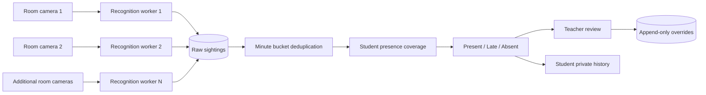
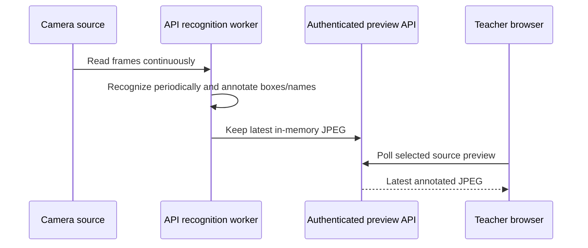

# Smart Classroom Attendance

Local-first, multi-camera classroom attendance with admin-managed rooms and cameras, browser enrollment, teacher review, AI-assisted attendance queries, and student attendance analytics.

## What the system does

- A single invite-code-protected admin creates rooms, manages permanent room codes, and configures each room's cameras.
- Admins can add, edit, enable, disable, and safely delete room cameras; rooms expose current availability and active-session usage.
- Students enroll with exactly three camera captures or image uploads.
- Teachers create classes, enter a valid room name/code per session, and run attendance without camera-management access.
- Each enabled camera in the selected room is processed by an independent recognition worker.
- Raw sightings are retained for audit and debugging.
- Attendance is calculated using one-minute presence windows, not raw detection counts.
- Teachers can review coverage, see annotated camera feeds, and append manual corrections.
- Teacher insights include timeline replay, camera-zone summaries and health state, first/last-seen explanations, arrival/departure signals, a review queue, and downloadable CSV integrity reports.
- Teachers can ask bounded natural-language questions about attendance through the optional OpenRouter integration.
- Students can view only their own classes and attendance history.

## Attendance model

For a 60-minute class, the system creates 60 one-minute windows. A student receives one credit for a window when at least one enabled camera confidently recognizes them during that minute.

```text
presence percentage = observed windows / eligible windows × 100
```

Example:

```text
Class duration:       60 minutes
Eligible windows:     60
Student observed:     50 windows
Presence percentage:  50 / 60 × 100 = 83.3%
```

The default automated rules are:

- `Present`: at least 70% presence and first observation within the grace period.
- `Late`: at least 70% presence but first observation after the grace period, or 30–69.9% coverage.
- `Absent`: below 30% coverage.

The current implementation uses the completed session duration to calculate eligible windows. Raw sightings from both cameras are collapsed into the same minute, so two cameras and repeated detections cannot double-count a student.

## System flow



## Camera preview flow

The browser does not open a second connection to a webcam. The recognition worker owns each configured source and publishes its latest bounded JPEG frame through an authenticated teacher endpoint.



Recognized faces are shown with green boxes and student names. Unknown faces are shown with red boxes and `Unknown`. The overlay is a visual explanation of recognition; the persisted attendance result remains the backend source of truth.

## Multi-camera behavior

- The admin configures one or more sources under a physical room; each camera belongs to exactly one room.
- Each enabled room source runs independently when a teacher starts a session in that room.
- A room permits only one active attendance session at a time.
- Legacy class-owned camera rows are retained only for historical compatibility and are not used by new sessions.
- A student recognized by either camera in a minute gets one presence credit for that minute.
- A student recognized by both cameras in the same minute still gets one credit.
- If a source cannot be opened by the API machine, its preview remains unavailable and its worker contributes no sightings.
- Select any enabled source from the teacher's **Camera feed** panel during an active session.

The camera URL must be reachable from the machine running FastAPI, not only from the teacher's browser. Typical sources include webcam index `0`, an HTTP/MJPEG URL, or an RTSP URL supported by the local OpenCV build.

## Running locally

### 1. Configure the environment

Copy the environment templates and set a real JWT secret for anything beyond a disposable local demo:

```bash
cp .env.example .env
cp apps/api/.env.example apps/api/.env
```

The API configuration includes:

- `DATABASE_URL`: PostgreSQL connection string.
- `JWT_SECRET`: secret used to sign login tokens.
- `TEACHER_INVITE_CODE`: required for teacher registration.
- `ADMIN_INVITE_CODE`: required to create the single local admin account.
- `CORS_ORIGINS`: comma-separated browser origins allowed by the API; defaults to `http://localhost:5173`.
- `MEDIA_ROOT`: local enrollment-photo storage directory.
- `OPENROUTER_API_KEY`: optional key for the bounded teacher attendance assistant.
- `OPENROUTER_MODEL`: optional OpenRouter model override.
- `VITE_API_BASE_URL`: browser URL for the API, normally `http://localhost:8000/api/v1`.

### 2. Start PostgreSQL

```bash
docker compose up -d postgres
```

### 3. Start the API

```bash
cd apps/api
.venv/bin/uvicorn app.main:app --reload
```

The API is available at `http://localhost:8000`. Check `http://localhost:8000/health` or open `http://localhost:8000/docs` for the interactive API contract.

### 4. Start the web app

From the repository root:

```bash
npm run dev:web
```

Open `http://localhost:5173`.

## How To Use

### Student workflow

1. Select **Register**, choose **Student**, and enter full name, roll number, email, and password.
2. Start the browser camera and capture exactly three reference photos. Individual captures can be retaken or removed before submitting.
3. Submit registration. The API validates the photos, generates local face encodings, and signs the student in.
4. Ask a teacher for the class join code, enter it under **Join a class**, and confirm the membership.
5. After completed sessions, view personal attendance percentage, Present/Late/Absent counts, coverage, and session history.

Students cannot see camera feeds, raw sightings, other students, teacher reports, embeddings, or enrollment paths.

### Admin workflow

1. Select **Register**, choose **Admin**, and use the configured `ADMIN_INVITE_CODE`. The local MVP permits one admin account.
2. Create a physical room. The system generates a permanent, case-insensitive room code that can be copied or regenerated.
3. Add one or more room cameras:
   - **Webcam**: a local OpenCV device index such as `0`.
   - **IP stream**: an HTTP/MJPEG or RTSP URL reachable from the FastAPI host.
   - **Video file**: a path readable by the FastAPI process.
4. Use the pencil action to edit a camera's label, source type, source value, and enabled state. Camera changes are blocked while the room has an active session.
5. Enable or disable cameras directly from the camera list. A camera can be deleted only when the room is idle and it has no sighting history; disable historical cameras instead.
6. Use room cards to monitor enabled-camera counts, availability, and current attendance-session usage.

### Teacher workflow

1. Select **Register**, choose **Teacher**, and use the configured `TEACHER_INVITE_CODE`.
2. Create a class and copy its join code for students.
3. Enter a session title and a valid room code or exact room name/number. Teachers may use any active room but cannot add, edit, enable, disable, or delete cameras.
4. Start the session. The API rejects an inactive/unknown room, a room without enabled cameras, or a room already running another session.
5. All enabled cameras in the selected room start automatically. Workers publish annotated previews, persist confident enrolled-student sightings, and record anonymous unknown-face events at most once per camera every five seconds.
6. Select a source in **Camera feed** to inspect its latest annotated frame. Green labels indicate recognized students; red `Unknown` labels are also shown as anonymous entries in **Recent detections**.
7. Stop the session to calculate attendance. The review table shows coverage, first/last recognition explanation, automated status, effective status, and manual correction controls. Anonymous detections appear in **Unknown attendance review** with a student list for each event. Choosing a student creates an audited attribution and refreshes that student's review coverage and derived status.
8. Open the insights below the review area to inspect timeline replay, camera-zone totals, camera health, and the prioritized review queue.
9. Use the download icon in attendance review to export the teacher-owned CSV integrity report, or use **Ask AI** for bounded questions about owned completed attendance records.

### Attendance correction workflow

Corrections are available only after a session is completed. Select **Edit**, choose the corrected status, and provide a reason. The automated result remains unchanged and every correction is retained as an append-only audit event.

### Session interpretation

- The class duration is calculated automatically from session start to stop time.
- Presence is calculated from distinct time windows, not raw detection count.
- The teacher chooses the attendance window size before starting a session: 1, 2, 5, 10, 15, 30, or 60 minutes. A student is credited once per configured window when recognized or manually assigned an unknown detection in that window.
- A camera outage can reduce the available evidence; inspect camera health and review flags before accepting borderline results.

## Project layout

```text
apps/api/       FastAPI, SQLAlchemy, recognition workers, attendance rules
apps/web/       React, TypeScript, Tailwind UI, API client
packages/       Shared contract notes
context/        Product, architecture, UI, standards, and progress docs
```

## Teacher intelligence features

Completed sessions expose a derived insights view without adding biometric data to the browser:

- **Timeline replay**: timestamped student sightings are shown in chronological order, capped to the latest 200 events.
- **Presence map / camera zones**: each configured source reports students seen and sighting volume; active sources also report healthy, degraded, or offline state based on the latest worker frame.
- **Attendance explanations**: coverage rows show first seen, last seen, camera count, and presence percentage.
- **Arrival and departure signals**: the first and last confident sightings identify late arrival and early departure review conditions.
- **Review queue**: borderline coverage, late first sightings, early departure, single-camera visibility, and no-sighting records are prioritized.
- **Integrity report**: teachers can download a CSV containing status, coverage, timing, camera count, and review reasons. It never contains embeddings, face distances, image paths, or raw media.

The API routes are teacher-owned: `GET /sessions/{session_id}/insights` and `GET /sessions/{session_id}/report.csv`.

## Feature status and limitations

Implemented workflows include invite-code-protected single-admin onboarding, admin room/code management, room-owned webcam/IP/video camera creation and editing, protected camera deletion, room occupancy, browser-camera enrollment, roll-number capture, role-based authentication, class membership, room-based multi-camera recognition, annotated previews, configurable presence-window attendance, teacher overrides, unknown-sighting attribution, student history, session insights, camera health summaries, review flags, bounded AI attendance queries, and CSV reports.

Unknown faces are persisted as anonymous operational events containing only the session, camera source, and timestamp. They are rate-limited to one event per camera every five seconds and displayed only to the owning teacher. By default they are excluded from attendance coverage, student analytics, and integrity reports. During completed-session review, a teacher may select an enrolled class student for an event; this creates a separate append-only assignment and contributes that event's time window to review coverage and the displayed derived status without changing the original anonymous sighting. No unknown-face image, embedding, distance, or inferred identity is stored.

The current MVP does not provide physical seating coordinates, automatic camera calibration, email/SMS alerts, multi-day trend dashboards, hosted deployment, or database migrations. `Base.metadata.create_all` is used for local startup schema creation.

## Privacy and access boundaries

- Students can read only their own attendance and joined classes.
- Admins manage room and camera configuration but cannot access embeddings, passwords, biometric files, or arbitrary database data.
- Teachers can manage only their own classes and sessions. Room cameras are read-only to teachers.
- Embeddings, password hashes, enrollment paths, and raw biometric media are never returned to the browser.
- Manual corrections are immutable audit events; automated attendance is never overwritten.

## Validation

```bash
npm run build:web
cd apps/api && .venv/bin/ruff check app
cd apps/api && .venv/bin/python -m compileall -q app
```
