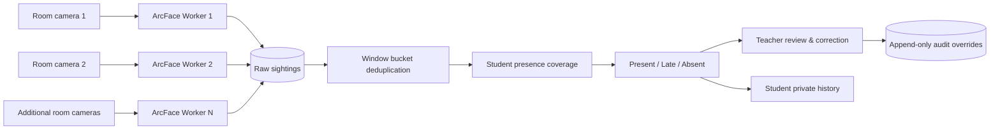
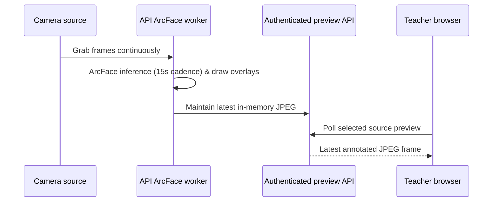

# Smart Classroom Attendance

Local-first, multi-camera classroom attendance with InsightFace ArcFace recognition, admin-managed rooms and cameras, MediaPipe guided browser enrollment, teacher review & AI analytics, and student attendance history.

## What the system does

- **Admin Room & Camera Management**: A single invite-code-protected admin creates rooms, manages permanent room codes, and configures each room's cameras (webcams, IP streams, video files).
- **Guided Student Onboarding**: Students enroll with browser camera captures guided by MediaPipe face pose detection (front, left, right poses) or file uploads.
- **Flexible Authentication**: Students can sign in using either their email address or unique roll number with password.
- **InsightFace ArcFace Engine**: High-accuracy 512-dimensional ArcFace face embeddings and cosine similarity matching (>= 0.5 threshold) across independent camera workers.
- **Efficient Inference Cadence**: 15-second recognition inference sampling cadence minimizes CPU/GPU overhead while delivering smooth live preview streams.
- **Configurable Presence Windows**: Attendance calculated over flexible qualification windows (15s, 30s, 1m, 2m, 5m, 10m, 15m, 30m, or 60m).
- **Teacher Operational Controls**: Teachers run room-based sessions, search enrolled students by name or roll number, delete obsolete completed sessions, review presence coverage, and record append-only manual corrections.
- **Teacher Intelligence & AI Assistant**: Deep session insights (timeline replay, camera health, review queue, CSV exports) and natural-language attendance queries via optional OpenRouter integration.
- **Student Privacy & Self-Service**: Students view only their own joined classes, presence metrics, and session history.

## Attendance model

Presence is calculated over continuous qualification windows across the total session duration rather than raw frame-by-frame detection counts.

```text
presence percentage = observed windows / eligible windows × 100
```

Example (for a 60-minute class with 1-minute qualification windows):

```text
Class duration:       60 minutes
Qualification window: 1 minute
Eligible windows:     60
Student observed:     50 windows
Presence percentage:  50 / 60 × 100 = 83.3%
```

Teachers can choose qualification window durations during session setup: **15 seconds, 30 seconds, 1 minute, 2 minutes, 5 minutes, 10 minutes, 15 minutes, 30 minutes, or 60 minutes**.

The default automated attendance rules are:

- `Present`: at least 70% presence coverage and first observation within the grace period.
- `Late`: at least 70% presence coverage but first observation after the grace period, or 30–69.9% coverage.
- `Absent`: below 30% coverage.

Raw sightings from multiple cameras are collapsed into the respective qualification window, so multiple cameras and repeated frame detections in the same window cannot double-count a student.

## System flow



## Recognition & Camera preview flow

The backend uses **InsightFace ArcFace** (`buffalo_l` model) running thread-safe `FaceAnalysis` instances per worker thread. Inference runs on a 15-second sampling cadence (or matched to the qualification window) while continuous frame grabbing ensures smooth preview streaming.

The browser does not open direct camera streams to physical IP webcams. The API recognition worker owns each configured source and publishes its latest annotated JPEG frame through an authenticated teacher endpoint.



Recognized enrolled faces display green bounding boxes with student names. Unknown faces display red boxes with `Unknown` labels and create rate-limited anonymous events (at most once every 5 seconds per camera).

## Multi-camera behavior

- The admin configures one or more camera sources per physical room; each camera belongs to exactly one room.
- When a teacher starts a session with a valid room code, every enabled camera in that room runs independently.
- A room permits only one active attendance session at a time.
- A student recognized by any room camera in a given qualification window receives one presence credit for that window.
- Multiple sightings across different cameras within the same window collapse into one credit.
- If a camera source is offline or unreachable, its worker logs no sightings and reports degraded/offline status in teacher health insights.

## Running locally

### 1. Configure the environment

Copy the environment templates and set appropriate invite codes and JWT secrets:

```bash
cp .env.example .env
cp apps/api/.env.example apps/api/.env
```

The API configuration includes:

- `DATABASE_URL`: PostgreSQL connection string.
- `JWT_SECRET`: Secret used to sign authentication tokens.
- `TEACHER_INVITE_CODE`: Required for teacher registration.
- `ADMIN_INVITE_CODE`: Required to register the single local admin account.
- `CORS_ORIGINS`: Comma-separated browser origins (defaults to `http://localhost:5173`).
- `MEDIA_ROOT`: Directory for student enrollment reference photos.
- `OPENROUTER_API_KEY`: Optional key for the teacher AI attendance assistant.
- `OPENROUTER_MODEL`: Optional OpenRouter model override.
- `VITE_API_BASE_URL`: Browser API endpoint (normally `http://localhost:8000/api/v1`).

### 2. Start PostgreSQL

```bash
docker compose up -d postgres
```

### 3. Start the API

```bash
cd apps/api
.venv/bin/uvicorn app.main:app --reload
```

The API is accessible at `http://localhost:8000`. Check `http://localhost:8000/health` or open `http://localhost:8000/docs` for interactive OpenAPI documentation.

*Note: On first execution, InsightFace automatically downloads the `buffalo_l` model (~300 MB).*

### 4. Start the web app

From the repository root:

```bash
npm run dev:web
```

Open `http://localhost:5173`.

## How To Use

### Student workflow

1. Select **Register**, choose **Student**, and enter full name, roll number, email, and password.
2. Grant camera access for guided **MediaPipe Face Landmarker** enrollment (capturing front, left, and right face poses automatically) or upload photo files.
3. Submit registration. The API extracts 512-d ArcFace embeddings, stores reference media locally, and signs the student in.
4. Sign in anytime using **Email** or **Roll Number** + password.
5. Join classes using teacher join codes, and view personal attendance percentage, coverage windows, and session history.

### Admin workflow

1. Select **Register**, choose **Admin**, and provide the `ADMIN_INVITE_CODE`.
2. Create physical rooms. The system generates permanent room codes that can be copied or regenerated.
3. Add room cameras:
   - **Webcam**: Local device index (e.g., `0`).
   - **IP stream**: HTTP/MJPEG or RTSP stream URL.
   - **Video file**: Path readable by the API host.
4. Edit camera labels, source types, source values, or enabled states when the room is idle.
5. Monitor room status, enabled camera counts, and active session occupancy.

### Teacher workflow

1. Select **Register**, choose **Teacher**, and provide the `TEACHER_INVITE_CODE`.
2. Create classes and share unique class join codes with students.
3. Start an attendance session by selecting a class, choosing a qualification window (15s to 60m), setting arrival grace minutes, and entering a room code.
4. Live camera workers stream annotated previews and log sightings automatically.
5. Use instant **Student Search** (by name or roll number) in session review or class roster views.
6. Stop the session to review presence coverage, status breakdowns, timeline replays, camera health, and unknown-face attributions.
7. Perform manual attendance overrides or delete obsolete completed sessions (with confirmation dialog and full audit cleanup).
8. Export CSV integrity reports or use **Ask AI** to ask natural-language questions about class attendance.

## Project layout

```text
apps/api/       FastAPI, SQLAlchemy, InsightFace ArcFace workers, attendance rules
apps/web/       Vite, React, TypeScript, Tailwind CSS UI, API client
packages/       Shared contract definitions
context/        Product, architecture, UI, standards, and progress documentation
```

## Feature status & key implementations

- **Face Recognition**: InsightFace ArcFace (`buffalo_l`) 512-d embeddings, cosine similarity threshold >= 0.5, 15-second inference sampling interval.
- **Enrollment**: Browser MediaPipe Face Landmarker pose guidance (front, left, right), image file upload fallback, roll-number capture.
- **Authentication**: JWT token-based auth, email or roll number login for students, invite-code protected admin and teacher registration.
- **Room & Camera Management**: Admin-owned physical rooms, permanent room codes, room-level camera CRUD (webcam, IP/RTSP, video file).
- **Session & Attendance Engine**: Flexible qualification windows (15s–60m), 5-second cross-camera de-duplication, automated Present/Late/Absent evaluation, append-only manual corrections, completed session deletion.
- **Intelligence & Analytics**: Multi-camera grid previews with annotated bounding boxes, timeline replay, camera zone coverage & health metrics, instant student searching by name/roll number, CSV integrity export, OpenRouter-powered Ask AI natural-language query assistant.

## Privacy and access boundaries

- **Role Boundaries**: Students read only personal attendance and joined classes. Teachers manage only owned classes and sessions. Admins manage room/camera infrastructure.
- **Biometric Isolation**: Biometric embeddings, raw reference photo paths, and password hashes are never sent to browser clients.
- **Audit Integrity**: Automated attendance calculations are preserved; manual corrections are logged as append-only audit events.

## Validation

```bash
npm run build:web
cd apps/api && .venv/bin/ruff check app
cd apps/api && .venv/bin/python -m compileall -q app
```
